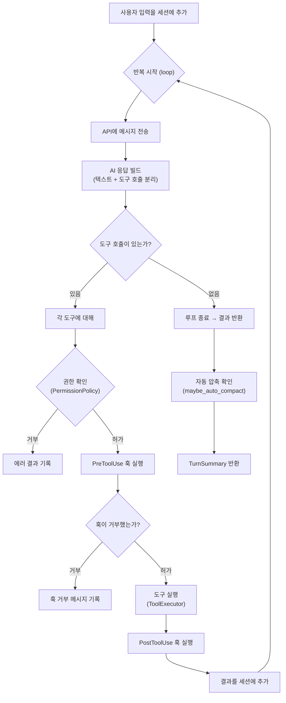
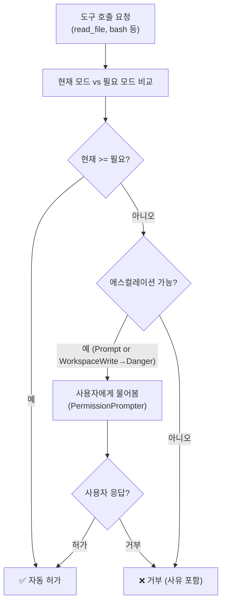
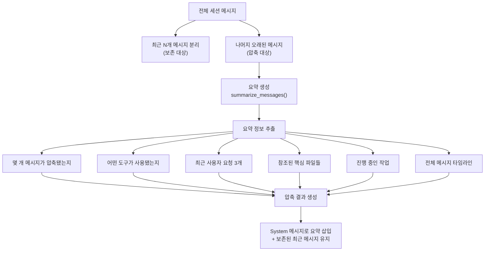

# 🐾 Claw Code 심화 딥다이브

> 기존 딥다이브에서 다루지 못한 내부 메커니즘과 아키텍처 패턴을 코드 레벨에서 심층 분석

---

## 목차

1. [대화 런타임 루프 (ConversationRuntime)](#1-대화-런타임-루프-conversationruntime)
2. [권한 시스템과 보안 모델](#2-권한-시스템과-보안-모델)
3. [훅 시스템 — 도구 실행 전/후 파이프라인](#3-훅-시스템--도구-실행-전후-파이프라인)
4. [컨텍스트 윈도우 관리 — 세션 압축(Compaction)](#4-컨텍스트-윈도우-관리--세션-압축compaction)
5. [시스템 프롬프트 조합 — CLAUDE.md와 설정 통합](#5-시스템-프롬프트-조합--claudemd와-설정-통합)
6. [SSE 스트리밍과 API 클라이언트 내부 구조](#6-sse-스트리밍과-api-클라이언트-내부-구조)
7. [토큰 사용량 추적 및 비용 예측 시스템](#7-토큰-사용량-추적-및-비용-예측-시스템)

---

## 1. 대화 런타임 루프 (ConversationRuntime)

> 기존 딥다이브에서 "Runtime이 AI와 도구를 연결하고 대화를 관리한다"고만 소개했습니다.
> 여기서는 **실제 코드의 `run_turn()` 메서드가 어떻게 동작하는지** 한 줄씩 분석합니다.

### ConversationRuntime의 구성 요소

📄 [rust/crates/runtime/src/conversation.rs](file:///Users/sangsulee/claw-code/rust/crates/runtime/src/conversation.rs) (100~110행)

```rust
pub struct ConversationRuntime<C, T> {
    session: Session,              // 전체 대화 기록 (메시지 히스토리)
    api_client: C,                 // Anthropic API 통신 (trait 기반)
    tool_executor: T,              // 도구 실행기 (trait 기반)
    permission_policy: PermissionPolicy,  // 권한 정책
    system_prompt: Vec<String>,    // 시스템 프롬프트 섹션들
    max_iterations: usize,         // 무한 루프 방지용 최대 반복 수
    usage_tracker: UsageTracker,   // 토큰 사용량 추적기
    hook_runner: HookRunner,       // PreToolUse / PostToolUse 훅 실행기
    auto_compaction_input_tokens_threshold: u32,  // 자동 압축 임계값
}
```

> [!IMPORTANT]
> **제네릭 타입 `<C, T>`** 에 주목하세요!
> `C`는 `ApiClient` trait, `T`는 `ToolExecutor` trait을 구현하면 됩니다.
> 이렇게 하면 **테스트에서 가짜(Mock) 클라이언트를 주입**할 수 있고, 실제 프로덕션에서는 `AnthropicClient`를 사용합니다.

```rust
// 이런 trait만 구현하면 어떤 LLM이든 연결 가능!
pub trait ApiClient {
    fn stream(&mut self, request: ApiRequest) -> Result<Vec<AssistantEvent>, RuntimeError>;
}

pub trait ToolExecutor {
    fn execute(&mut self, tool_name: &str, input: &str) -> Result<String, ToolError>;
}
```

### run_turn() — 한 턴의 전체 흐름

📄 [rust/crates/runtime/src/conversation.rs](file:///Users/sangsulee/claw-code/rust/crates/runtime/src/conversation.rs) (170~283행)



핵심 코드를 단계별로 해설합니다:

**1단계: 사용자 입력 추가**
```rust
self.session.messages
    .push(ConversationMessage::user_text(user_input.into()));
```
→ 사용자가 입력한 텍스트를 대화 히스토리에 `user` 역할로 추가합니다.

**2단계: API 호출 및 응답 파싱**
```rust
let events = self.api_client.stream(request)?;
let (assistant_message, usage) = build_assistant_message(events)?;
```
→ API에서 받은 스트리밍 이벤트(`TextDelta`, `ToolUse`, `Usage`, `MessageStop`)를
하나의 `ConversationMessage`로 조립합니다.

**3단계: 도구 호출 추출**
```rust
let pending_tool_uses = assistant_message.blocks.iter()
    .filter_map(|block| match block {
        ContentBlock::ToolUse { id, name, input } => Some((...)),
        _ => None,
    })
    .collect::<Vec<_>>();
```
→ AI 응답에서 `ToolUse` 블록만 뽑아 실행할 도구 목록을 만듭니다.

**4단계: 도구 실행 (권한 + 훅 + 실행)**
```rust
let permission_outcome = self.permission_policy
    .authorize(&tool_name, &input, Some(*prompt));

match permission_outcome {
    PermissionOutcome::Allow => {
        // PreToolUse 훅 → 도구 실행 → PostToolUse 훅
    }
    PermissionOutcome::Deny { reason } => {
        // 거부 사유를 tool_result로 기록
    }
}
```
→ 매 도구 호출마다 **권한 → 사전 훅 → 실행 → 사후 훅** 의 4단계 파이프라인을 거칩니다.

**5단계: 자동 압축**
```rust
let auto_compaction = self.maybe_auto_compact();
```
→ 누적 input_tokens가 임계값(기본 200,000)을 초과하면 오래된 메시지를 요약으로 압축합니다.

### 테스트에서 배우는 설계: ScriptedApiClient

테스트 코드를 보면 런타임이 얼마나 잘 분리되어 있는지 알 수 있습니다:

```rust
struct ScriptedApiClient { call_count: usize }

impl ApiClient for ScriptedApiClient {
    fn stream(&mut self, request: ApiRequest) -> Result<Vec<AssistantEvent>, RuntimeError> {
        self.call_count += 1;
        match self.call_count {
            1 => Ok(vec![                           // 첫 번째 호출: 도구 사용 결정
                AssistantEvent::ToolUse { id: "tool-1", name: "add", input: "2,2" },
                AssistantEvent::MessageStop,
            ]),
            2 => Ok(vec![                           // 두 번째 호출: 최종 답변
                AssistantEvent::TextDelta("The answer is 4."),
                AssistantEvent::MessageStop,
            ]),
            _ => Err(RuntimeError::new("unexpected extra API call")),
        }
    }
}
```

→ **실제 API 호출 없이** 도구 호출 → 결과 반환 → 최종 답변의 전체 루프를 테스트합니다.
→ 이것이 **의존성 주입(Dependency Injection)** 의 위력입니다.

---

## 2. 권한 시스템과 보안 모델

> "AI가 bash 명령어를 실행하려고 할 때, 사용자에게 물어봐야 할까?" — 이 질문에 답하는 시스템입니다.

### 권한 모드 계층 구조

📄 [rust/crates/runtime/src/permissions.rs](file:///Users/sangsulee/claw-code/rust/crates/runtime/src/permissions.rs) (3~10행)

```rust
pub enum PermissionMode {
    ReadOnly,          // 가장 제한적 — 읽기만 가능
    WorkspaceWrite,    // 워크스페이스 내 파일 쓰기 가능
    DangerFullAccess,  // 모든 것 가능 (위험!)
    Prompt,            // 매번 사용자에게 물어봄
    Allow,             // 모든 것 허용 (권한 확인 안 함)
}
```

이 모드들은 **순서(PartialOrd)**가 있습니다:
```
ReadOnly < WorkspaceWrite < DangerFullAccess
```

### 도구별 필요 권한과 인가(Authorization) 로직

```rust
pub fn authorize(
    &self,
    tool_name: &str,
    input: &str,
    mut prompter: Option<&mut dyn PermissionPrompter>,
) -> PermissionOutcome {
    let current_mode = self.active_mode();
    let required_mode = self.required_mode_for(tool_name); // 도구마다 다름

    // 현재 모드가 필요 모드 이상이면 → 자동 허가!
    if current_mode == PermissionMode::Allow || current_mode >= required_mode {
        return PermissionOutcome::Allow;
    }

    // Prompt 모드이거나, 에스컬레이션이 필요한 경우 → 사용자에게 물어봄
    if current_mode == PermissionMode::Prompt
        || (current_mode == WorkspaceWrite && required_mode == DangerFullAccess)
    {
        return match prompter.as_mut() {
            Some(prompter) => match prompter.decide(&request) { ... },
            None => PermissionOutcome::Deny { ... },
        };
    }

    PermissionOutcome::Deny { ... }  // 그 외 → 거부
}
```

### 권한 판단 흐름도



### 실제 도구별 권한 예시

| 도구 | 필요 권한 | ReadOnly 모드에서 | WorkspaceWrite 모드에서 |
|------|----------|-----------------|----------------------|
| `read_file` | ReadOnly | ✅ 허가 | ✅ 허가 |
| `write_file` | WorkspaceWrite | ❌ 거부 | ✅ 허가 |
| `bash` | DangerFullAccess | ❌ 거부 | ⚠️ 사용자 확인 필요 |

### 샌드박스 — bash 명령어의 추가 보안 레이어

📄 [rust/crates/runtime/src/sandbox.rs](file:///Users/sangsulee/claw-code/rust/crates/runtime/src/sandbox.rs)

권한 시스템 외에도, bash 명령어에는 **샌드박스**라는 추가 보안 레이어가 있습니다:

```rust
pub enum FilesystemIsolationMode {
    Off,             // 격리 없음
    WorkspaceOnly,   // 워크스페이스 폴더만 접근 가능 (기본값!)
    AllowList,       // 허용 목록에 있는 경로만 접근 가능
}
```

Linux에서는 `unshare` 명령어로 실제 OS 레벨 격리를 수행합니다:

```rust
// 샌드박스된 bash 실행 구조
let mut args = vec![
    "--user",          // 사용자 네임스페이스 분리
    "--map-root-user", // 루트 매핑
    "--mount",         // 마운트 네임스페이스 분리
    "--ipc",           // IPC 네임스페이스 분리
    "--pid",           // PID 네임스페이스 분리
    "--uts",           // 호스트명 네임스페이스 분리
    "--fork",          // 프로세스 포크
];
if status.network_active {
    args.push("--net");  // 네트워크 격리 (인터넷 차단)
}
```

> [!TIP]
> 컨테이너(Docker/Kubernetes) 안에서 실행되고 있는지도 자동 감지합니다.
> `/.dockerenv` 파일, `KUBERNETES_SERVICE_HOST` 환경변수, `/proc/1/cgroup` 내용 등을 확인합니다.

---

## 3. 훅 시스템 — 도구 실행 전/후 파이프라인

> 훅(Hook)은 도구가 실행되기 전/후에 자동으로 실행되는 외부 스크립트입니다.
> 도구 사용을 감시, 차단, 또는 피드백을 추가하는 데 사용됩니다.

### 훅 설정 방법

`.claude/settings.json` 에서 설정합니다:

```json
{
  "hooks": {
    "PreToolUse": ["python3 check_security.py"],
    "PostToolUse": ["python3 log_tool_usage.py"]
  }
}
```

### 훅의 종류와 역할

| 이벤트 | 실행 시점 | 용도 |
|-------|----------|------|
| **PreToolUse** | 도구 실행 **전** | 파일 수정 차단, 보안 검사 |
| **PostToolUse** | 도구 실행 **후** | 결과 로깅, 린트 결과 추가 |

### 훅 실행 내부 구조

📄 [rust/crates/runtime/src/hooks.rs](file:///Users/sangsulee/claw-code/rust/crates/runtime/src/hooks.rs) (95~150행)

```rust
fn run_commands(&self, event: HookEvent, commands: &[String], ...) -> HookRunResult {
    for command in commands {
        match self.run_command(command, ...) {
            HookCommandOutcome::Allow { message } => {
                // 정상 실행 → 피드백 메시지 추가 가능
                messages.push(message);
            }
            HookCommandOutcome::Deny { message } => {
                // 도구 실행을 차단!
                return HookRunResult { denied: true, messages };
            }
            HookCommandOutcome::Warn { message } => {
                // 경고만 남기고 계속 진행
                messages.push(message);
            }
        }
    }
    HookRunResult::allow(messages)  // 모든 훅 통과
}
```

### 훅의 exit code 규약

| Exit Code | 의미 | 동작 |
|-----------|------|------|
| **0** | ✅ 허가 | 도구 실행 계속, stdout을 메시지로 전달 |
| **2** | ❌ 차단 | 도구 실행 중단! stdout을 차단 사유로 전달 |
| **기타** | ⚠️ 경고 | 도구 실행 계속, 경고 메시지 추가 |

### 훅에 전달되는 환경변수

훅 스크립트는 다음 환경변수를 통해 도구 호출 정보를 받습니다:

```bash
HOOK_EVENT="PreToolUse"          # 또는 "PostToolUse"
HOOK_TOOL_NAME="bash"            # 호출된 도구 이름
HOOK_TOOL_INPUT='{"command":"rm -rf /"}'  # 도구 입력 (JSON)
HOOK_TOOL_IS_ERROR="0"           # 이전 실행이 에러였는지 (PostToolUse만)
HOOK_TOOL_OUTPUT="..."           # 도구 실행 결과 (PostToolUse만)
```

추가로, stdin으로 아래 JSON 페이로드도 전달됩니다:
```json
{
  "hook_event_name": "PreToolUse",
  "tool_name": "bash",
  "tool_input": { "command": "rm -rf /" },
  "tool_input_json": "{\"command\":\"rm -rf /\"}",
  "tool_output": null,
  "tool_result_is_error": false
}
```

### 훅 피드백이 도구 결과에 통합되는 방식

```rust
fn merge_hook_feedback(messages: &[String], output: String, denied: bool) -> String {
    // 훅 메시지가 도구 결과에 추가됨 → AI가 훅의 피드백을 읽을 수 있음!
    sections.push(format!("{label}:\n{}", messages.join("\n")));
}
```

→ 예를 들어 PostToolUse 훅에서 "lint 경고 3건 발견"이라고 출력하면,
AI는 다음 대화 턴에서 그 경고를 보고 자동으로 수정을 시도할 수 있습니다.

---

## 4. 컨텍스트 윈도우 관리 — 세션 압축(Compaction)

> LLM의 컨텍스트 윈도우는 유한합니다.
> 대화가 길어지면 예전 메시지를 **요약으로 압축**해야 합니다.

### 압축 결정 기준

📄 [rust/crates/runtime/src/compact.rs](file:///Users/sangsulee/claw-code/rust/crates/runtime/src/compact.rs)

```rust
pub fn should_compact(session: &Session, config: CompactionConfig) -> bool {
    session.messages.len() > config.preserve_recent_messages  // 충분한 메시지가 있고
        && estimate_session_tokens(session) >= config.max_estimated_tokens  // 토큰이 많으면
}
```

기본 설정:
```rust
CompactionConfig {
    preserve_recent_messages: 4,       // 최근 4개 메시지는 보존
    max_estimated_tokens: 10_000,      // 수동 트리거 시 임계값
}
```

자동 압축은 별도의 임계값을 사용합니다:
```rust
const DEFAULT_AUTO_COMPACTION_INPUT_TOKENS_THRESHOLD: u32 = 200_000;
// 환경 변수로 조절 가능: CLAUDE_CODE_AUTO_COMPACT_INPUT_TOKENS
```

### 토큰 추정 방식

```rust
fn estimate_message_tokens(message: &ConversationMessage) -> usize {
    message.blocks.iter().map(|block| match block {
        ContentBlock::Text { text } => text.len() / 4 + 1,           // 4글자 ≈ 1토큰
        ContentBlock::ToolUse { name, input, .. } =>
            (name.len() + input.len()) / 4 + 1,
        ContentBlock::ToolResult { tool_name, output, .. } =>
            (tool_name.len() + output.len()) / 4 + 1,
    }).sum()
}
```

> [!NOTE]
> 실제 토큰화 기반이 아니라 **글자 수 ÷ 4** 로 추정합니다. 정확도보다 속도를 우선한 합리적 선택입니다.

### 압축 과정 상세



### 압축 요약의 실제 형식

```xml
<summary>
Conversation summary:
- Scope: 12 earlier messages compacted (user=3, assistant=5, tool=4).
- Tools mentioned: bash, read_file, write_file.
- Recent user requests:
  - 이 함수에 에러 핸들링 추가해줘
  - 테스트 코드도 작성해줘
- Key files referenced: src/main.rs, src/lib.rs.
- Current work: 테스트 코드를 작성 중입니다.
- Key timeline:
  - user: 이 함수에 에러 핸들링 추가해줘
  - assistant: tool_use read_file({"path":"src/main.rs"})
  - tool: tool_result read_file: fn main() { ...
  ...
</summary>
```

### 핵심 파일 추출 로직

```rust
fn extract_file_candidates(content: &str) -> Vec<String> {
    content.split_whitespace()
        .filter_map(|token| {
            let candidate = token.trim_matches(|c| matches!(c, ',' | '.' | ':' | ...));
            if candidate.contains('/') && has_interesting_extension(candidate) {
                Some(candidate.to_string())
            } else { None }
        })
        .collect()
}
```

→ 대화 내용에서 `/` 가 포함된 토큰 중 `.rs`, `.ts`, `.js`, `.json`, `.md` 확장자가 있는 것을 파일 경로로 인식합니다.

---

## 5. 시스템 프롬프트 조합 — CLAUDE.md와 설정 통합

> Claw Code는 여러 소스에서 지침을 수집하여 하나의 시스템 프롬프트를 조합합니다.

### 프롬프트 빌더 패턴

📄 [rust/crates/runtime/src/prompt.rs](file:///Users/sangsulee/claw-code/rust/crates/runtime/src/prompt.rs)

```rust
pub fn load_system_prompt(cwd, current_date, os_name, os_version) -> Vec<String> {
    let project_context = ProjectContext::discover_with_git(&cwd, current_date)?;
    let config = ConfigLoader::default_for(&cwd).load()?;
    Ok(SystemPromptBuilder::new()
        .with_os(os_name, os_version)              // OS 정보
        .with_project_context(project_context)      // 프로젝트 + git 정보
        .with_runtime_config(config)                // 설정 파일 정보
        .build())
}
```

### 시스템 프롬프트의 구성 섹션

`build()` 메서드가 조합하는 섹션들을 순서대로 정리하면:

```
┌─────────────────────────────────────────────────┐
│ 1. Intro Section                                │
│    "You are an interactive agent that helps..."  │
├─────────────────────────────────────────────────┤
│ 2. Output Style (선택적)                         │
│    "Prefer short answers." 등                    │
├─────────────────────────────────────────────────┤
│ 3. System Section                               │
│    도구 사용 규칙, 보안 주의사항 등                  │
├─────────────────────────────────────────────────┤
│ 4. Doing Tasks Section                          │
│    코드 변경 모범 사례 6가지                        │
├─────────────────────────────────────────────────┤
│ 5. Actions Section                              │
│    "가역성과 영향 범위를 신중히 고려하라"            │
├─────────────────────────────────────────────────┤
│ ════ DYNAMIC BOUNDARY ════                      │
│ (이 아래는 동적으로 변하는 부분)                    │
├─────────────────────────────────────────────────┤
│ 6. Environment Context                          │
│    모델명, CWD, 날짜, OS 정보                     │
├─────────────────────────────────────────────────┤
│ 7. Project Context                              │
│    git status, git diff 스냅샷                   │
├─────────────────────────────────────────────────┤
│ 8. Claude Instructions (CLAUDE.md 내용)         │
│    프로젝트별, 상위 디렉토리별 지침 파일             │
├─────────────────────────────────────────────────┤
│ 9. Runtime Config                               │
│    settings.json 에서 읽은 설정값                 │
└─────────────────────────────────────────────────┘
```

### CLAUDE.md 파일 탐색 방식

```rust
fn discover_instruction_files(cwd: &Path) -> Vec<ContextFile> {
    // cwd에서 루트까지 모든 상위 디렉토리를 순회
    let mut directories = Vec::new();
    let mut cursor = Some(cwd);
    while let Some(dir) = cursor {
        directories.push(dir.to_path_buf());
        cursor = dir.parent();
    }
    directories.reverse();  // 루트 → cwd 순서로

    // 각 디렉토리에서 4가지 파일을 찾음
    for dir in directories {
        for candidate in [
            dir.join("CLAUDE.md"),
            dir.join("CLAUDE.local.md"),
            dir.join(".claude").join("CLAUDE.md"),
            dir.join(".claude").join("instructions.md"),
        ] {
            push_context_file(&mut files, candidate)?;
        }
    }
    dedupe_instruction_files(files)  // 중복 제거 (내용 기반 해시)
}
```

예를 들어 `/home/user/project/apps/api/` 에서 실행하면:

```
/ → CLAUDE.md? CLAUDE.local.md? .claude/CLAUDE.md? .claude/instructions.md?
/home/ → (동일 패턴)
/home/user/ → (동일 패턴)
/home/user/project/ → ✅ CLAUDE.md 발견!
/home/user/project/apps/ → ✅ CLAUDE.md 발견!
/home/user/project/apps/api/ → ✅ .claude/CLAUDE.md 발견!
```

### 프롬프트 예산 관리 (Budget)

```rust
const MAX_INSTRUCTION_FILE_CHARS: usize = 4_000;   // 파일당 최대 4천 글자
const MAX_TOTAL_INSTRUCTION_CHARS: usize = 12_000;  // 총 최대 12,000 글자
```

→ CLAUDE.md 내용이 너무 길면 잘라내고 `[truncated]` 표시를 추가합니다.

### Git 정보 수집

```rust
fn read_git_status(cwd: &Path) -> Option<String> {
    // `git --no-optional-locks status --short --branch` 실행
}

fn read_git_diff(cwd: &Path) -> Option<String> {
    // staged changes: `git diff --cached`
    // unstaged changes: `git diff`
}
```

→ AI에게 **현재 코드 변경 상태**를 알려주어 더 정확한 응답을 유도합니다.

### 설정 파일 계층 구조

📄 [rust/crates/runtime/src/config.rs](file:///Users/sangsulee/claw-code/rust/crates/runtime/src/config.rs)

```
우선순위 (상위가 덮어씀):
1. ~/.claude.json                    ← User 레벨
2. ~/.claude/settings.json           ← User 레벨
3. {cwd}/.claude.json               ← Project 레벨
4. {cwd}/.claude/settings.json      ← Project 레벨
5. {cwd}/.claude/settings.local.json ← Local 레벨 (git ignore 대상)
```

> [!TIP]
> `deep_merge_objects()` 함수로 JSON 객체를 재귀적으로 병합합니다.
> 같은 키가 있으면 하위 설정이 상위 설정을 덮어씁니다.

---

## 6. SSE 스트리밍과 API 클라이언트 내부 구조

> 기존 딥다이브에서 API 요청/응답의 JSON 구조만 소개했습니다.
> 여기서는 **스트리밍 전송**, **SSE 파싱**, **재시도 로직** 의 내부를 분석합니다.

### SSE (Server-Sent Events) 란?

```
보통의 HTTP 요청:
Client ──── 요청 ────→ Server
Client ←──── 응답 ────── Server (한 번에 전체 응답)

SSE 스트리밍:
Client ──── 요청 ────→ Server
Client ←── 조각1 ──── Server
Client ←── 조각2 ──── Server
Client ←── 조각3 ──── Server
Client ←── ... ──────── Server (실시간으로 조각씩 도착)
```

### SSE 프레임 구조

📄 [rust/crates/api/src/sse.rs](file:///Users/sangsulee/claw-code/rust/crates/api/src/sse.rs)

실제 API에서 오는 SSE 데이터의 형태:

```
event: content_block_delta
data: {"type":"content_block_delta","index":0,"delta":{"type":"text_delta","text":"Hello"}}

event: message_stop
data: {"type":"message_stop"}

data: [DONE]
```

- `event:` 라인 → 이벤트 종류 (선택적)
- `data:` 라인 → JSON 페이로드 (핵심 데이터)
- 빈 줄 (`\n\n`) → 하나의 프레임 경계

### SseParser — 청크 단위 파싱

```rust
pub struct SseParser {
    buffer: Vec<u8>,   // 아직 완전한 프레임이 되지 않은 데이터
}

impl SseParser {
    pub fn push(&mut self, chunk: &[u8]) -> Result<Vec<StreamEvent>, ApiError> {
        self.buffer.extend_from_slice(chunk);          // 새 데이터를 버퍼에 추가
        let mut events = Vec::new();

        while let Some(frame) = self.next_frame() {     // 완전한 프레임이 있으면
            if let Some(event) = parse_frame(&frame)? {  // JSON → StreamEvent 변환
                events.push(event);
            }
        }
        Ok(events)
    }

    fn next_frame(&mut self) -> Option<String> {
        // \n\n 또는 \r\n\r\n 으로 프레임 경계를 찾음
        let separator = self.buffer.windows(2)
            .position(|window| window == b"\n\n");
        // 찾으면 해당 프레임을 drain으로 추출
    }
}
```

> [!IMPORTANT]
> 네트워크 전송 시 하나의 SSE 프레임이 **여러 TCP 청크로 분리**될 수 있습니다.
> `SseParser`는 버퍼에 데이터를 쌓아두고, `\n\n` 경계를 찾을 때만 파싱합니다.
> 이것이 **스트리밍 파서**의 핵심 패턴입니다.

### StreamEvent 타입 계층

📄 [rust/crates/api/src/types.rs](file:///Users/sangsulee/claw-code/rust/crates/api/src/types.rs)

```rust
pub enum StreamEvent {
    MessageStart(MessageStartEvent),       // 메시지 시작 (모델 정보 포함)
    ContentBlockStart(ContentBlockStartEvent), // 텍스트/도구 블록 시작
    ContentBlockDelta(ContentBlockDeltaEvent),  // 텍스트 조각 도착
    ContentBlockStop(ContentBlockStopEvent),    // 블록 종료
    MessageDelta(MessageDeltaEvent),        // stop_reason, 사용량 정보
    MessageStop(MessageStopEvent),          // 메시지 완전 종료
}

pub enum ContentBlockDelta {
    TextDelta { text: String },           // 텍스트 조각: "Hel" → "lo" → " World"
    InputJsonDelta { partial_json: String }, // 도구 입력 JSON 조각
}
```

### 재시도 로직 (Exponential Backoff)

📄 [rust/crates/api/src/client.rs](file:///Users/sangsulee/claw-code/rust/crates/api/src/client.rs) (273~307행)

```rust
async fn send_with_retry(&self, request: &MessageRequest) -> Result<Response, ApiError> {
    let mut attempts = 0;
    loop {
        attempts += 1;
        match self.send_raw_request(request).await {
            Ok(response) => match expect_success(response).await {
                Ok(response) => return Ok(response),
                Err(error) if error.is_retryable() && attempts <= self.max_retries + 1 => {
                    last_error = Some(error);
                }
                Err(error) => return Err(error),  // 재시도 불가능한 에러
            },
            Err(error) if error.is_retryable() && attempts <= self.max_retries + 1 => {
                last_error = Some(error);
            }
            Err(error) => return Err(error),
        }
        tokio::time::sleep(self.backoff_for_attempt(attempts)?).await;
    }
}
```

**Exponential Backoff** 공식:
```
대기 시간 = min(200ms × 2^(attempt-1), 2초)

attempt 1: 200ms
attempt 2: 400ms
attempt 3: 800ms (이미 최대 2회 재시도 초과)
```

**재시도 가능한 HTTP 상태 코드:**
```rust
const fn is_retryable_status(status: StatusCode) -> bool {
    matches!(status.as_u16(),
        408 |  // Request Timeout
        409 |  // Conflict
        429 |  // Rate Limited (Too Many Requests)
        500 |  // Internal Server Error
        502 |  // Bad Gateway
        503 |  // Service Unavailable
        504    // Gateway Timeout
    )
}
```

### 인증 방식

```rust
pub enum AuthSource {
    None,                          // 인증 없음
    ApiKey(String),                // x-api-key 헤더
    BearerToken(String),           // Authorization: Bearer 헤더
    ApiKeyAndBearer { ... },       // 두 가지 모두 (OAuth + API Key)
}
```

인증 소스 탐색 우선순위:

```
1. ANTHROPIC_API_KEY 환경변수
2. ANTHROPIC_AUTH_TOKEN 환경변수
3. 저장된 OAuth 토큰 (만료 시 자동 갱신)
```

---

## 7. 토큰 사용량 추적 및 비용 예측 시스템

> AI API 사용에는 비용이 발생합니다. Claw Code는 실시간으로 토큰 사용량과 예상 비용을 추적합니다.

### 토큰 사용량 구조

📄 [rust/crates/runtime/src/usage.rs](file:///Users/sangsulee/claw-code/rust/crates/runtime/src/usage.rs)

```rust
pub struct TokenUsage {
    pub input_tokens: u32,                   // 입력 토큰 수
    pub output_tokens: u32,                  // 출력 토큰 수
    pub cache_creation_input_tokens: u32,    // 캐시 생성에 사용된 토큰
    pub cache_read_input_tokens: u32,        // 캐시에서 읽은 토큰
}
```

### 모델별 가격 정책

```rust
pub fn pricing_for_model(model: &str) -> Option<ModelPricing> {
    let normalized = model.to_ascii_lowercase();
    if normalized.contains("haiku") {
        return Some(ModelPricing {
            input_cost_per_million: 1.0,       // $1/1M tokens
            output_cost_per_million: 5.0,      // $5/1M tokens
            cache_creation_cost_per_million: 1.25,
            cache_read_cost_per_million: 0.1,
        });
    }
    if normalized.contains("opus") {
        return Some(ModelPricing {
            input_cost_per_million: 15.0,      // $15/1M tokens
            output_cost_per_million: 75.0,     // $75/1M tokens!
            ...
        });
    }
    if normalized.contains("sonnet") {
        return Some(ModelPricing::default_sonnet_tier());
    }
    None  // 알 수 없는 모델 → 기본 가격 사용
}
```

### 모델별 비용 비교표

| 모델 | 입력 ($/1M) | 출력 ($/1M) | 캐시 생성 ($/1M) | 캐시 읽기 ($/1M) |
|------|------------|------------|----------------|----------------|
| **Haiku** | $1.00 | $5.00 | $1.25 | $0.10 |
| **Sonnet** | $15.00 | $75.00 | $18.75 | $1.50 |
| **Opus** | $15.00 | $75.00 | $18.75 | $1.50 |

### UsageTracker — 누적 추적

```rust
pub struct UsageTracker {
    latest_turn: TokenUsage,      // 직전 턴의 사용량
    cumulative: TokenUsage,       // 전체 대화 누적 사용량
    turns: u32,                   // 총 턴 수
}

impl UsageTracker {
    pub fn record(&mut self, usage: TokenUsage) {
        self.latest_turn = usage;
        self.cumulative.input_tokens += usage.input_tokens;
        self.cumulative.output_tokens += usage.output_tokens;
        // ... 캐시 토큰도 누적
        self.turns += 1;
    }
}
```

### 세션 복원 시 사용량 재구성

대화를 이어서 할 때, 기존 세션의 사용량을 자동으로 복원합니다:

```rust
pub fn from_session(session: &Session) -> Self {
    let mut tracker = Self::new();
    for message in &session.messages {
        if let Some(usage) = message.usage {  // 각 assistant 메시지에 저장된 usage
            tracker.record(usage);
        }
    }
    tracker
}
```

### 비용 출력 포맷

```
usage: total_tokens=1800200 input=1200000 output=500000 cache_write=100000 cache_read=200 estimated_cost=$54.6754 model=claude-sonnet-4-20250514
  cost breakdown: input=$15.0000 output=$37.5000 cache_write=$1.8750 cache_read=$0.3000
```

---

## 🔑 핵심 설계 패턴 정리

이 프로젝트에서 발견할 수 있는 주요 소프트웨어 엔지니어링 패턴을 정리합니다:

### 1. Trait 기반 의존성 주입 (Dependency Injection)

```rust
// 프로덕션: 실제 API 호출
ConversationRuntime::new(session, AnthropicClient::new(key), RealToolExecutor, ...)

// 테스트: 가짜 API 클라이언트
ConversationRuntime::new(session, ScriptedApiClient { call_count: 0 }, MockToolExecutor, ...)
```

**배우는 점**: 핵심 비즈니스 로직(`run_turn`)을 외부 의존성(API, 파일시스템)에서 완전히 분리합니다.

### 2. Builder 패턴 (점진적 구성)

```rust
SystemPromptBuilder::new()
    .with_os("linux", "6.8")
    .with_project_context(context)
    .with_runtime_config(config)
    .build()
```

**배우는 점**: 옵셔널한 설정이 많을 때, 메서드 체이닝으로 가독성 있게 구성합니다.

### 3. 계층적 설정 병합 (Configuration Layering)

```
User 설정 → Project 설정 → Local 설정 (우선순위 높음)
```

**배우는 점**: 다양한 범위의 설정을 `deep_merge`로 하나로 통합합니다.

### 4. 파이프라인 패턴 (도구 실행)

```
권한 확인 → PreToolUse 훅 → 도구 실행 → PostToolUse 훅 → 결과 반환
```

**배우는 점**: 각 단계에서 실행을 차단하거나 피드백을 추가할 수 있는 확장 지점을 제공합니다.

### 5. 스트리밍 파서 (Incremental Parser)

```
네트워크 청크 → 버퍼 → 프레임 경계 탐색 → JSON 파싱
```

**배우는 점**: 불완전한 데이터를 다루는 **증분 파싱(incremental parsing)** 기법입니다.

---

## 📚 더 공부하면 좋은 주제

이 심화 문서에서도 다루지 않은, 추가 탐색이 가능한 영역들:

| 주제 | 관련 파일 | 설명 |
|------|----------|------|
| MCP (Model Context Protocol) | `runtime/src/mcp.rs`, `mcp_client.rs`, `mcp_stdio.rs` | 외부 도구 서버와의 표준 프로토콜 |
| OAuth 2.0 인증 흐름 | `runtime/src/oauth.rs`, `api/src/client.rs` | 브라우저 기반 인증 + 토큰 갱신 |
| CLI 렌더링 엔진 | `rusty-claude-cli/src/render.rs` | 마크다운/코드 블록 터미널 렌더링 |
| 커스텀 JSON 파서 | `runtime/src/json.rs` | serde 없이 직접 구현한 JSON 파서 |
| 원격 런타임 (Remote) | `runtime/src/remote.rs` | 서버 사이드 실행 지원 |
| 슬래시 명령어 시스템 | `crates/commands/` | `/help`, `/status`, `/compact` 등 |
